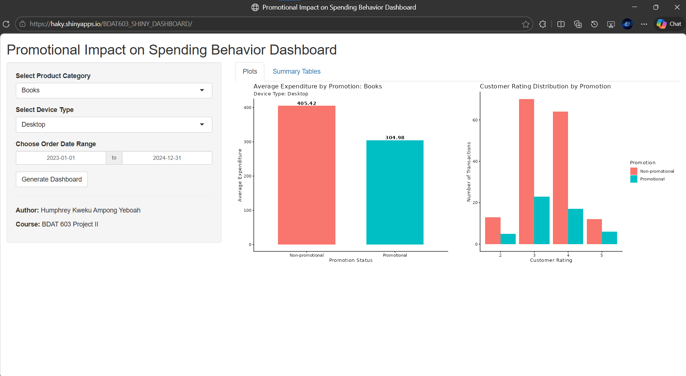

# BDAT 603 Project II: Interactive Sales Dashboard

**Author:** Humphrey Kweku Ampong Yeboah

**Live Demo:** [https://haky.shinyapps.io/BDAT603_SHINY_DASHBOARD/](https://haky.shinyapps.io/BDAT603_SHINY_DASHBOARD/)

## Overview

This repository contains a fully functional interactive Shiny application developed for the BDAT 603: Descriptive Analytics course. 

The application utilizes a simulated online sales dataset to explore the promotional impact on spending behavior. It demonstrates proper UI and Server structuring, reactive programming principles, and interactive descriptive analytics.



## Repository Contents

* `app.R`: The core Shiny application script containing the UI definition, server logic, and standard data simulation.
* `BDAT603_SHINY_DEPLOY.Rproj`: The RStudio project configuration file.
* `.gitignore`: Specifies intentionally untracked files, including local rsconnect deployment states.
* `Spark_Architecture.Rmd`: An R Markdown document containing the original, fully compliant Apache Spark (`sparklyr`) implementation of the project requirements for grading and reference.

## Architecture & Deployment Note

The primary project specifications strictly required an Apache Spark connection (sparklyr) to handle data sampling and filtering before collecting results to R. 

However, to successfully deploy this application to the free tier of shinyapps.io, the data workflow in this specific repository was adapted to use standard dplyr operations. This architectural adjustment prevents the server crashes and memory timeouts associated with attempting to run a local Spark cluster alongside a Shiny app in a constrained 1GB RAM cloud environment. All UI components, inputs, outputs, and reactive logic remain identical to the Spark-based implementation.

For documentation and academic reference, the original Spark-dependent codebase is preserved and documented within the `Spark_Architecture.Rmd` file.

## Features

* **Interactive Inputs:** Filter data dynamically using drop-down selections and date ranges (Product Category, Device Type, Order Date).
* **Event-Driven Execution:** Visualizations and computations are triggered only after clicking the "Generate Dashboard" action button, utilizing eventReactive.
* **Tabbed Navigation:** Outputs are neatly organized using tabsetPanel.
* **Visual Analytics:** Two distinct plots comparing average customer expenditure and rating distributions across promotional states.
* **Summary Data:** Two tabular summaries outlining numerical metrics and payment method distributions.

## Local Setup Instructions

To run this project locally on your Windows machine:

1. **Clone the repository:**

```bash
   git clone [https://github.com/hakylepremier/bdat603-shiny-deploy](https://github.com/hakylepremier/bdat603-shiny-deploy)

```

2. **Open the Project:** Double-click the `BDAT603_SHINY_DEPLOY.Rproj` file. This will automatically launch RStudio and set your working directory to the project folder.

3. **Install Dependencies:** Ensure you have the required packages installed in your R environment:

```r
install.packages(c("shiny", "tidyverse", "lubridate"))

```

4. **Run the App:** Open `app.R` and click the **Run App** button located at the top right of the RStudio source editor.
